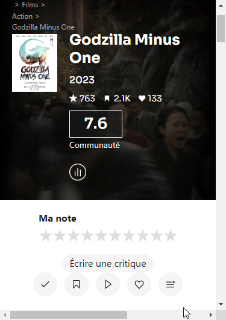
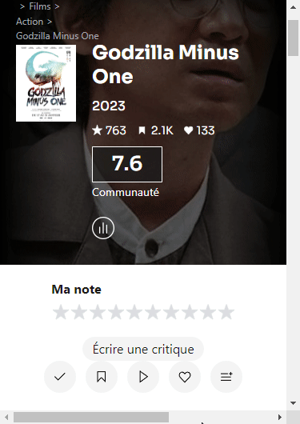

# Sens Critique - Auto Remove from Wishlist v1.0.0

## Description
This script prevents items from persisting in our wishlist after being marked as seen/read.

## Comparaisons
Here are 2 gifs to compare behaviours (with and without script execution) when marking an item as seen/read that was originally in our wishlist

- #### Without script

- ### With script
